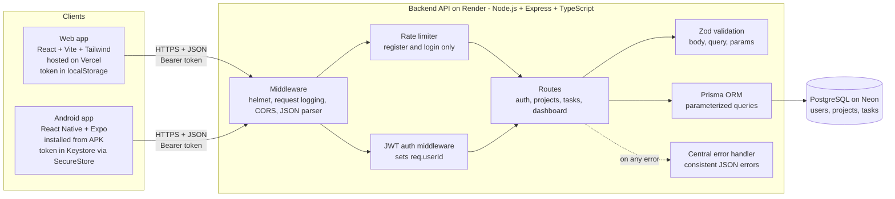
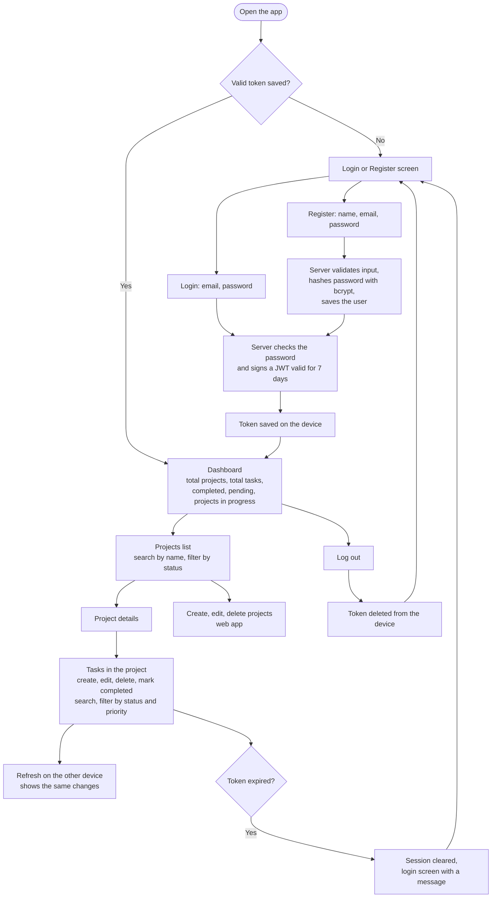
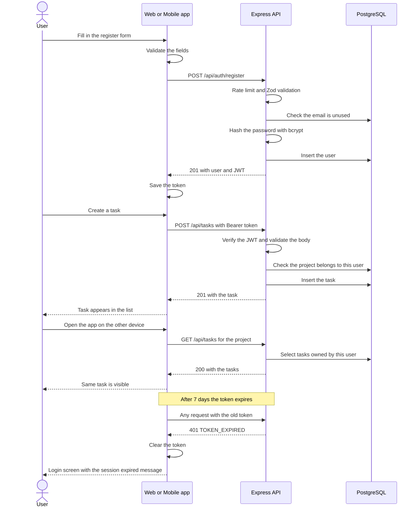

# Architecture

One backend serves both clients. A user can register or log in on the web or on Android, and sees the same data on both.

## 1. System architecture

| Layer | Technology | Responsibility |
|---|---|---|
| Web client | React, Vite, Tailwind, React Router | Screens, forms, calls the API through one client |
| Mobile client | React Native, Expo, React Navigation | Same features on a phone, secure token storage, offline banner |
| API | Express 5, TypeScript | Authentication, authorization, validation, business rules |
| Data access | Prisma | Typed, parameterized queries and migrations |
| Database | PostgreSQL (Neon) | Stores users, projects, tasks with foreign keys |
| Hosting | Vercel, Render, Neon, GitHub | Web, API, database, source code |

## 2. What a user can do(Process Diagram)

Project create, edit and delete are available on the web app. The Android app shows projects and covers all task actions, as the brief requires.

## 3. Request flow: register, use the app, token expiry

## 4. Security layers

| Layer | Protection |
|---|---|
| Transport | HTTPS everywhere (Vercel, Render, Neon with SSL) |
| Edge | helmet headers, CORS allow-list, rate limit on register and login |
| Authentication | bcrypt password hashes, JWT checked on every protected route |
| Authorization | Every query is scoped to the signed-in user. Tasks are checked through their project's owner. Other users' data returns 404 |
| Input | Zod validates every body, query and URL parameter before it reaches the database |
| Database | Prisma parameterized queries, foreign keys, unique email, cascade deletes |
| Secrets | Environment variables only. `.env` is never committed |
| Mobile storage | Token in Android Keystore (iOS Keychain) through expo-secure-store |
