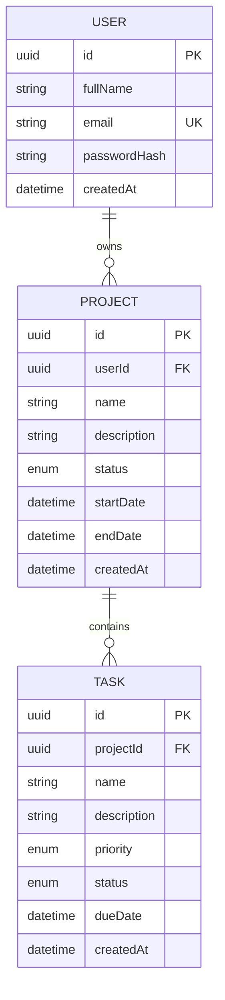

# Database schema (ER diagram)

PostgreSQL, managed with Prisma (`backend/prisma/schema.prisma`).

## Relationships

- One user owns many projects. Deleting a user deletes their projects (`ON DELETE CASCADE`).
- One project contains many tasks. Deleting a project deletes its tasks (`ON DELETE CASCADE`).
- `email` is unique. `projects.userId` and `tasks.projectId` are indexed.

## Enums

| Enum | Values |
|---|---|
| Project status | `NOT_STARTED`, `IN_PROGRESS`, `COMPLETED` |
| Task status | `PENDING`, `IN_PROGRESS`, `COMPLETED` |
| Task priority | `LOW`, `MEDIUM`, `HIGH` |

## Normalization

Each table stores facts about one entity. Tasks reference their project, and projects reference their owner, so ownership is stored once and no data is duplicated.
